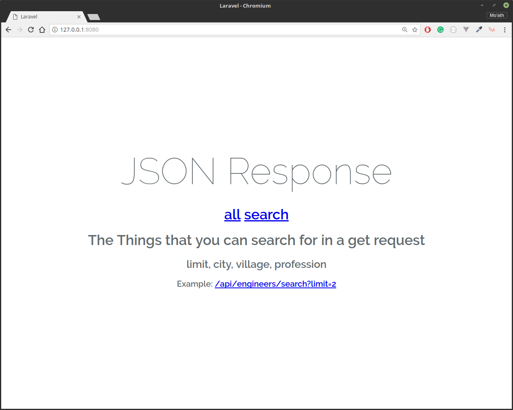
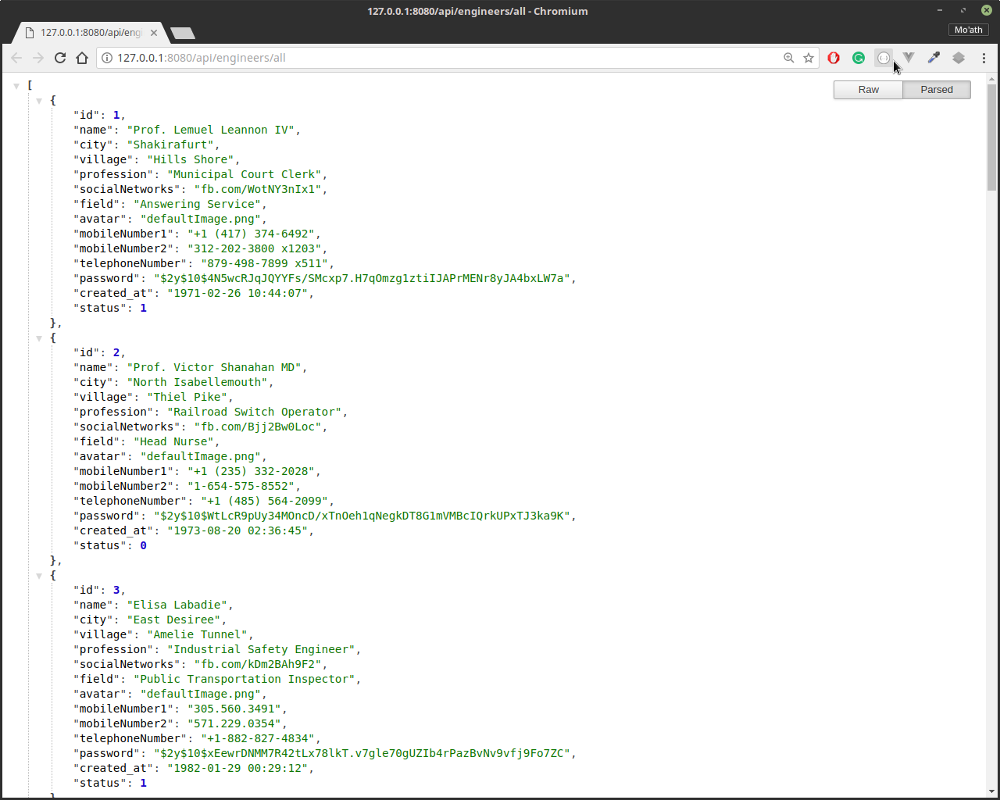
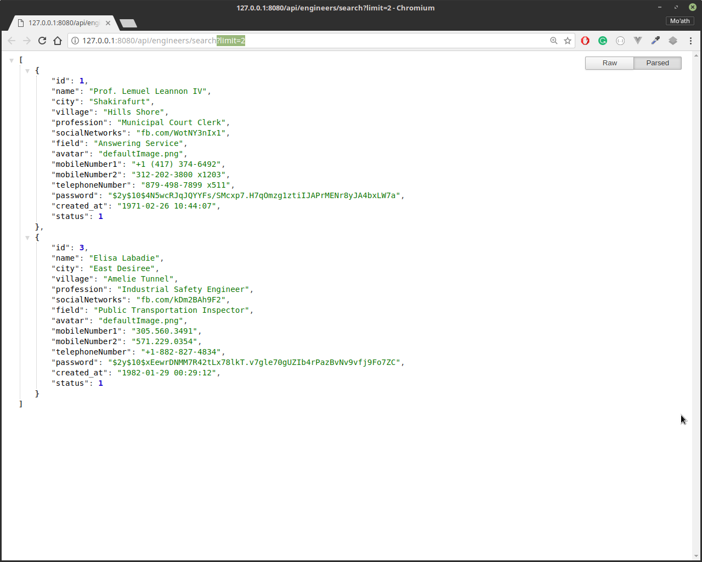

# JSON Response
Based on  Laravel

## Home Page

## View all the Engineers

## Search



## If you wish to run this project 

you may have to edit this file ***.env*** to use the proper data for your database setup

```
...
DB_DATABASE=homestead
DB_USERNAME=homestead
DB_PASSWORD=secret
...
```
don't forget to create the database 


### Open the terminal in the project directory

#### To create the tables run
> php artisan migrate


#### To generate random data open the tinker
> php artisan tinker
#### and run

>	factory('App\Engineer', 20)->create();

this will generate 20 Engineer


# NOW TO RUN THE PROJECT
  you have two choices
  
1) from the terminal run
> php artisan serv

2) or from a virtual machine using ***vagrant***

> composer require laravel/homestead

> php vendor/bin/homestead make

> vagrant up


